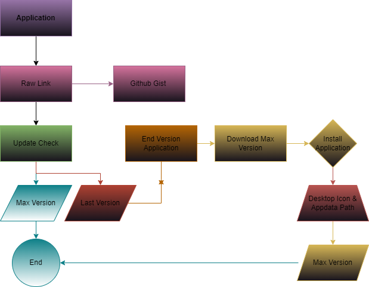
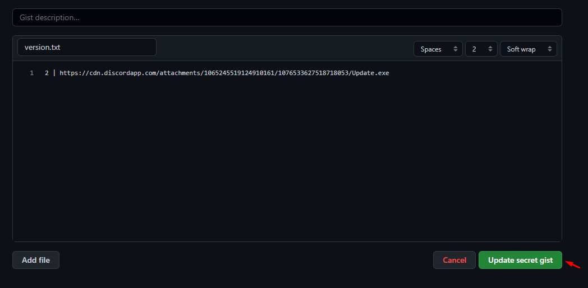
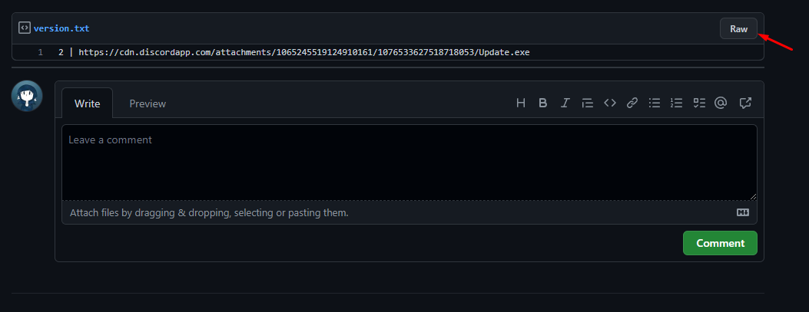
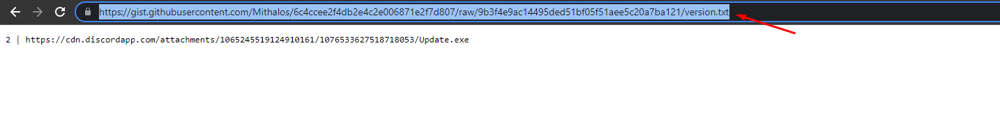
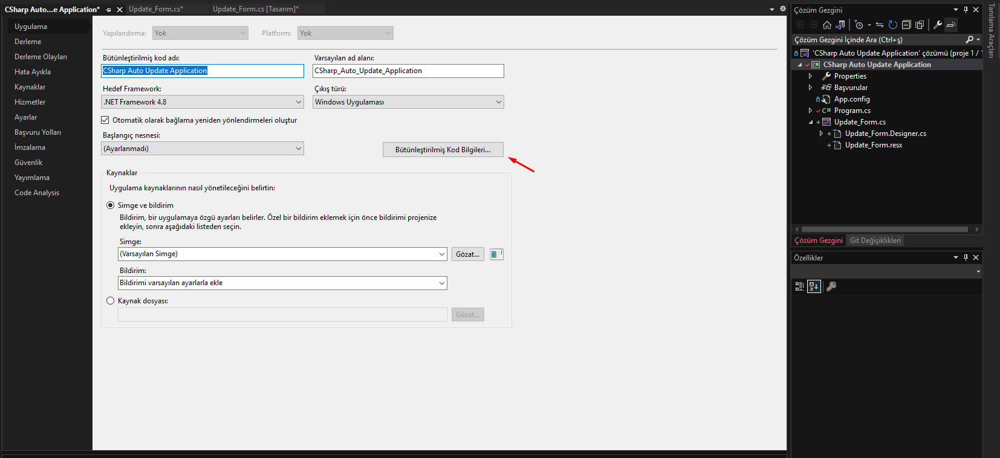
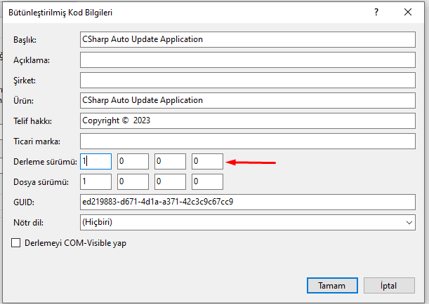
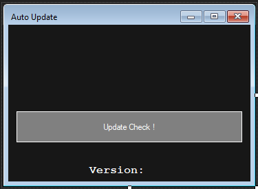
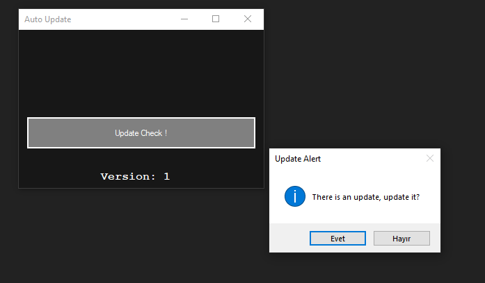
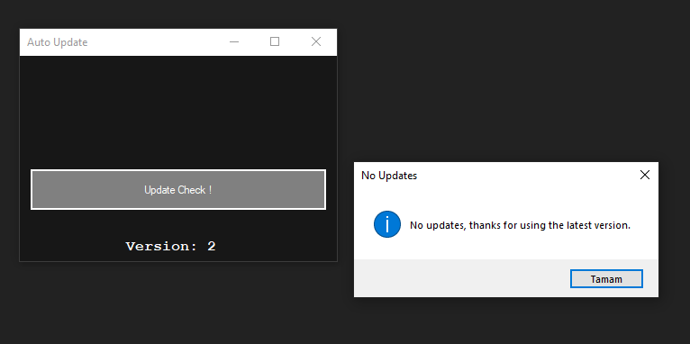

# CSharp Auto Update Application

Application Algorithm

<h1 align="center">
  
</h1>

<h1 align="center">How to Get Raw Link</h1>

<b>First we will get the download link. You can use tons of CDNs for this. Or drop the exe file anywhere in discord and get the link that way</b>

<h1 align="center">
  
</h1>

Where will the app get new app information? Here is the <a href="https://gist.github.com">Github Gist</a>. Version | Link will be used from the figure.  (Version 1.2 should not be like V1.2 , 1.0.0.2.)

<h1 align="center">
  
</h1>

Raw From Gist To Get Raw Link

<h1 align="center">
  
</h1>

Raw Link Copy

<h1 align="center">
  
</h1>

Raw From Gist To Get Raw Link

<h1 align="center">
  
</h1>

The Build Version We Get The Application Version And Increase The Version According To It

<h1 align="center">
  
</h1>

Application Before Running Normal Version

<h1 align="center">
  
</h1>

Checking the App Version and Preparing for the New Version

<h1 align="center">
  
</h1>

The application downloads the new version and installs and runs the new version by stopping and deleting the old application

<h1 align="center">
  
</h1>

